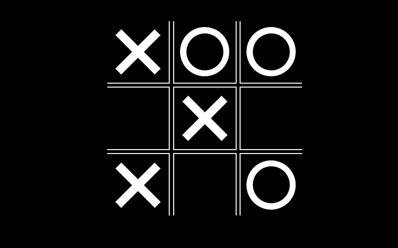

<h3 align="center">Tic Tac Toe Game</h3>

<h3 align="center">Personal project for me to enhance my JavaScript skills.</h3>

<h3 align="center">https://ag-tictactoe.web.app/</h3>

## Table Of Contents

- [Table Of Contents](#table-of-contents)
- [About The Project](#about-the-project)
- [Showcase](#showcase)
- [Getting Started](#getting-started)
- [Authors](#authors)

## About the project

Welcome to my "Tic Tac Toe Game" project! 🎮

This project offers a classic game of Tic Tac Toe with a twist. Using HTML, CSS, and JavaScript, players can challenge themselves against either another player or a computer opponent. It's worth noting that the computer opponent isn't particularly intelligent; it's programmed to place its moves randomly, providing a fun and casual gaming experience.

**Objective**:

With this project, my aim is to demonstrate my skills in JavaScript programming and DOM manipulation. By implementing game logic and player interactions, I'm showcasing my ability to create interactive web applications. This project not only serves as a fun diversion but also highlights my dedication to develop my programming abilities and delivering enjoyable user experiences through code.

## Showcase

`/`

## Getting Started

To enjoy the Tic Tac Toe game simply press the link below.

https://ag-tictactoe.web.app/

## Authors

- _Arminas Griesius_ - Front End developer - [Arminas Griesius](https://github.com/ArminasGriesius) - All Work